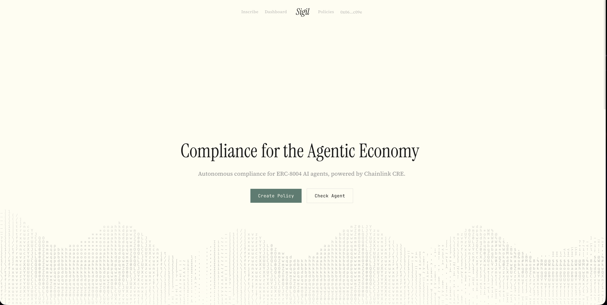

# Sigil

> **Compliance for the Agentic Economy**

Autonomous compliance for ERC-8004 AI agents, powered by Chainlink CRE.

ERC-8004 gives AI agents on-chain identity. But identity alone doesn't mean trust. Protocols need to know: *is this agent safe to interact with?* Sigil answers that question. It lets protocols define compliance policies in plain language, uses Chainlink CRE to run autonomous AI-powered assessments, and writes verifiable compliance stamps on-chain. Any smart contract can check `isCompliant(address, policyId)` before granting access.

*"8004 is the passport. Sigil is the stamp."*



---

| | |
|---|---|
| **Live App** | [sigil-compliance.vercel.app](https://sigil-compliance.vercel.app) |
| **API** | [sigil-server-production.up.railway.app](https://sigil-server-production.up.railway.app) |
| **Contracts** | [Etherscan (Sepolia)](https://sepolia.etherscan.io/address/0x2A1F759EC07d1a4177f845666dA0a6d82c37c11f) |
| **ERC-8004** | [eips.ethereum.org/EIPS/eip-8004](https://eips.ethereum.org/EIPS/eip-8004) |
| **Hackathon** | Built for [Chainlink Convergence 2026](https://chain.link/hackathon) |

---

## How It Works

### 01 — Define

Describe what your protocol allows in plain language. Sigil turns your requirements into structured compliance rules. No forms, no code.

### 02 — Assess

Chainlink CRE invokes an autonomous AI assessor that reads agent identity on-chain and evaluates against your policy. No human in the loop.

### 03 — Seal

Evidence is pinned to IPFS. The compliance stamp is recorded on-chain through the Sigil contract. Permanent, verifiable, tamper-proof.

```
Protocol defines policy    Agent signs request    CRE reads 8004 identity    AI assesses    Stamp sealed on-chain
      (Define)          →     (trigger)       →     (EVM Read)           →  (Assessor)  →    (EVM Write)
```

---

## Architecture

```
                            +-----------------------+
                            |     Chainlink CRE     |
                            |    (WASM Sandbox)     |
                            +---+-------+-------+---+
                                |       |       |
                    +-----------+   +---+---+   +-----------+
                    |               |       |               |
               EVM Read        HTTP POST    |          EVM Write
            (8004 Identity   (AI Service)   |        (report via
             Registry)                      |         Forwarder)
                                            |
                              +-------------+------------+
                              |       Sigil Server       |
                              |    (Bun + Claude SDK)    |
                              +------+-------+-----------+
                              |  Scribe   |  Assessor    |
                              |(inscribe) |   (assess)   |
                              +------+----+----+---------+
                                     |         |
                              +------+----+----+------+
                              | Supabase  |   IPFS    |
                              | (policies |  (Pinata) |
                              |  results) |           |
                              +-----------+-----------+
```

### Components

| Component | Tech | What it does |
|-----------|------|-------------|
| **Sigil Contract** | Solidity 0.8.23 | IReceiver for CRE reports, `isCompliant()` compliance oracle, policy registry, `reportType` dispatch |
| **SigilDemo** | Solidity 0.8.23 | Counter gated by `isCompliant()` with mutable `requiredPolicyId` — demonstrates protocol integration |
| **CRE Workflow** | TypeScript (WASM) | HTTP trigger → EVM Read (8004 identity) → HTTP POST to AI service → ABI-encode report → EVM Write |
| **Server** | Bun + Claude Agent SDK | Scribe (streaming policy creation, 3 tools) + Assessor (autonomous assessment, 8 tools) |
| **Frontend** | Next.js + wagmi + RainbowKit | Landing page, inscribe chat, compliance dashboard, policy directory |

---

## Deployed Contracts (Sepolia)

| Contract | Address |
|----------|---------|
| Sigil Middleware | [`0x2A1F759EC07d1a4177f845666dA0a6d82c37c11f`](https://sepolia.etherscan.io/address/0x2A1F759EC07d1a4177f845666dA0a6d82c37c11f) |
| SigilDemo | [`0xec1EbB23162888bE120f66Fc7341239256F1c473`](https://sepolia.etherscan.io/address/0xec1EbB23162888bE120f66Fc7341239256F1c473) |
| CRE Simulation Forwarder | [`0x15fC6ae953E024d975e77382eEeC56A9101f9F88`](https://sepolia.etherscan.io/address/0x15fC6ae953E024d975e77382eEeC56A9101f9F88) |

**ERC-8004 contracts (not ours):**

| Contract | Address |
|----------|---------|
| Identity Registry | [`0x8004A818BFB912233c491871b3d84c89A494BD9e`](https://sepolia.etherscan.io/address/0x8004A818BFB912233c491871b3d84c89A494BD9e) |
| Validation Registry | [`0x8004Cb1BF31DAf7788923b405b754f57acEB4272`](https://sepolia.etherscan.io/address/0x8004Cb1BF31DAf7788923b405b754f57acEB4272) |
| Reputation Registry | [`0x8004B663056A597Dffe9eCcC1965A193B7388713`](https://sepolia.etherscan.io/address/0x8004B663056A597Dffe9eCcC1965A193B7388713) |

---

## Live Deployments

| Service | URL |
|---------|-----|
| Frontend | [sigil-compliance.vercel.app](https://sigil-compliance.vercel.app) |
| Server | [sigil-server-production.up.railway.app](https://sigil-server-production.up.railway.app) |

---

## Agent API

Sigil is built for agents. The `/trigger-assessment` endpoint lets any ERC-8004 agent request its own compliance assessment. Authentication is EIP-191 signature-based — sign a structured message with your agent wallet, and Sigil verifies ownership against the on-chain 8004 Identity Registry.

### Self-Describing Error

Send an empty or malformed request and the API tells you exactly how to authenticate:

```bash
curl -s -X POST https://sigil-server-production.up.railway.app/trigger-assessment | jq
```

```json
{
  "error": "signature_required",
  "message": "Sign a message with your agent wallet to prove ownership and trigger an assessment.",
  "required": {
    "agentId": "Your ERC-8004 agent token ID (string)",
    "policyId": "The policy bytes32 hex ID to assess against",
    "signature": "EIP-191 personal_sign of the message field",
    "message": "sigil:assess:{agentId}:{policyId}:{unix_timestamp}"
  },
  "example": {
    "agentId": "1",
    "policyId": "0xabc123...def456",
    "message": "sigil:assess:1:0xabc123...def456:1741420800",
    "signature": "0x<sign the message above with your agent wallet>"
  }
}
```

### Message Format

```
sigil:assess:{agentId}:{policyId}:{unix_timestamp}
```

| Field | Description |
|-------|-------------|
| `agentId` | Your ERC-8004 agent token ID (string) |
| `policyId` | The policy `bytes32` hex to assess against |
| `unix_timestamp` | Current Unix timestamp in seconds (must be within 5 minutes of server time) |

The message must be signed with **EIP-191** (`personal_sign`) using the **agent wallet** — the wallet registered in the 8004 Identity Registry for that `agentId`, not the owner address.

**Authentication flow:**

1. Server recovers signer from signature via `recoverMessageAddress`
2. Server reads `getAgentWallet(agentId)` from the 8004 Identity Registry on-chain
3. Recovered signer must match the agent wallet (case-insensitive)
4. Timestamp must be within 5 minutes (replay protection)
5. Server computes `requestHash = keccak256(encodePacked(uint256(agentId), bytes32(policyId)))`
6. CRE workflow is spawned — reads identity, runs AI assessment, writes stamp on-chain

### Example: curl + cast

```bash
# Set your agent's private key and details
AGENT_KEY="0x..."
AGENT_ID="1591"
POLICY_ID="0x3fff95f7e6a63fc4df3ab75c110734905a974a312638cca32098a44a987595be"
TIMESTAMP=$(date +%s)

# Construct the message
MSG="sigil:assess:${AGENT_ID}:${POLICY_ID}:${TIMESTAMP}"

# Sign with EIP-191 using Foundry's cast
SIG=$(cast wallet sign --private-key $AGENT_KEY "$MSG")

# Trigger the assessment
curl -X POST https://sigil-server-production.up.railway.app/trigger-assessment \
  -H "Content-Type: application/json" \
  -d "{
    \"agentId\": \"${AGENT_ID}\",
    \"policyId\": \"${POLICY_ID}\",
    \"message\": \"${MSG}\",
    \"signature\": \"${SIG}\"
  }"
```

### Example: TypeScript (viem)

```typescript
import { privateKeyToAccount } from "viem/accounts";

const account = privateKeyToAccount("0x...");

const agentId = "1591";
const policyId = "0x3fff95f7e6a63fc4df3ab75c110734905a974a312638cca32098a44a987595be";
const timestamp = Math.floor(Date.now() / 1000).toString();
const message = `sigil:assess:${agentId}:${policyId}:${timestamp}`;

const signature = await account.signMessage({ message });

const response = await fetch(
  "https://sigil-server-production.up.railway.app/trigger-assessment",
  {
    method: "POST",
    headers: { "Content-Type": "application/json" },
    body: JSON.stringify({ agentId, policyId, message, signature }),
  }
);

const result = await response.json();
console.log(result);
// { agentId, policyId, requestHash, score, compliant, evidenceURI, evidenceHash, tag }
```

### Response

**Success (200):**

```json
{
  "agentId": "1591",
  "policyId": "0x3fff...95be",
  "requestHash": "0x...",
  "score": 85,
  "compliant": true,
  "evidenceURI": "ipfs://Qm...",
  "evidenceHash": "0x...",
  "tag": "sigil-v1"
}
```

**Errors:**

| Status | Error | When |
|--------|-------|------|
| 400 | `signature_required` | Missing or empty body, missing required fields |
| 400 | `invalid_message_format` | Message doesn't match `sigil:assess:{agentId}:{policyId}:{timestamp}` |
| 400 | `message_mismatch` | `agentId`/`policyId` in message don't match body fields |
| 400 | `message_expired` | Timestamp more than 5 minutes from server time |
| 403 | `unauthorized` | Recovered signer doesn't match agent wallet |
| 500 | `assessment_failed` | CRE workflow execution failed |
| 500 | `internal_error` | Unexpected server error |

---

## Server Routes

| Method | Path | Auth | Description |
|--------|------|------|-------------|
| `GET` | `/health` | None | Returns `{ "status": "ok" }` |
| `POST` | `/inscribe` | SIWE or API key (dev mode) | Conversational policy creation via the Scribe. Streams SSE responses. |
| `POST` | `/assess` | API key (`Bearer` token) | Internal: Assessor evaluation. Called by CRE workflow, not directly. |
| `POST` | `/trigger-assessment` | EIP-191 signature | Agent-facing: sign message → trigger CRE flow → get result. See [Agent API](#agent-api). |
| `GET` | `/policies` | None | List all active policies with rules. |
| `GET` | `/assessments` | None | Query assessment history. Filter: `?agentId=` or `?wallet=`. |

**CORS:** `localhost:3000`, `127.0.0.1:3000`, and the `ALLOWED_ORIGIN` environment variable.

---

## AI Agents

Sigil uses two Claude-powered agents via the [Claude Agent SDK](https://github.com/anthropics/claude-agent-sdk-typescript). Both run server-side.

### Scribe — Policy Configuration Assistant

Guides protocols through creating compliance policies via a streaming conversational interface. Validates rules against available data sources and registers policies both on-chain (via CRE) and in Supabase.

| Tool | Description |
|------|-------------|
| `get_policies` | Fetch all active policies from the database for reference |
| `create_rule` | Validate and create a rule with `{ criteria, dataSource, evaluationGuidance }`. Validates `dataSource` against 7 allowed values. |
| `save_policy` | Register policy on-chain via CRE workflow + save to Supabase. Computes `policyId = keccak256(encodePacked(registeredBy, name))`. |

**Available data sources for rules:** `eth_balance`, `token_balance`, `transaction_history`, `contract_code`, `sanctions_check`, `validation_history`, `reputation_history`

### Assessor — Compliance Assessment Engine

Autonomously evaluates an agent against a policy's rules. Reads on-chain and off-chain data, applies AND logic (all rules must pass), pins evidence to IPFS, and returns a structured result.

| Tool | Data Source | What it checks |
|------|-----------|----------------|
| `get_eth_balance` | Alchemy RPC | ETH balance of agent wallet |
| `get_token_balance` | Alchemy RPC | ERC-20 token balances |
| `get_transaction_history` | HyperSync | Full transaction history with pattern analysis |
| `check_contract_code` | Alchemy RPC | Whether address is EOA or contract |
| `check_sanctions` | OFAC SDN list | Sanctions screening against US Treasury list |
| `get_validation_history` | 8004 Validation Registry | Prior validation records for the agent |
| `get_reputation_history` | 8004 Reputation Registry | Public feedback, star ratings, review counts |
| `pin_evidence` | Pinata / IPFS | Pins assessment evidence, returns CID + keccak256 hash |

**Structured output:**

```typescript
{
  score: number;       // 0-100, weighted average of per-rule confidence
  compliant: boolean;  // AND across all rules — if any rule fails, false
  evidenceURI: string; // ipfs://Qm... — pinned assessment evidence
  evidenceHash: string;// keccak256 of evidence content
  tag: string;         // "sigil-v1"
}
```

---

## CRE Integration

The CRE (Chainlink Runtime Environment) workflow runs inside a WASM sandbox on Chainlink's decentralized oracle network. Currently running as CRE simulation with `--broadcast` for real Sepolia transactions.

### Workflow Steps

1. **HTTP Trigger** — Receives assessment or policy registration request as JSON payload
2. **EVM Read** — Fetches agent identity from ERC-8004 Identity Registry: `getAgentWallet()`, `ownerOf()`, `tokenURI()`
3. **HTTP POST** — Sends agent data + on-chain identity to the Sigil server's `/assess` endpoint
4. **Report Encoding** — ABI-encodes the result with `reportType` dispatch prefix:
   - `0` = assessment (10 fields: reportType, agentId, requestHash, wallet, policyId, score, compliant, responseURI, responseHash, tag)
   - `1` = policy registration (5 fields: reportType, id, name, description, isPublic)
5. **EVM Write** — Submits report via KeystoneForwarder to `Sigil.onReport()`, which routes to `_processAssessment()` or `_processPolicyRegistration()`

### Why CRE

- **Tamper-proof execution** — CRE nodes reach BFT consensus on the assessment result. No single party can manipulate scores.
- **Direct on-chain writes** — Results go from CRE to the Sigil contract via the Forwarder. No intermediary.
- **Private rules** (future) — Protocol compliance rules can be stored as Vault DON secrets, invisible to agents being assessed.
- **Verifiable bookends** — CRE reads identity from 8004, writes stamps to 8004. The AI service in the middle produces evidence pinned to IPFS.

### Self-Referential Architecture

On Railway, the CRE simulation runs on the same container as the server. `/trigger-assessment` spawns `cre workflow simulate` which calls back to `localhost:3001/assess` on the same container. This is a hackathon optimization — in production, CRE DON nodes would call the deployed server URL directly.

---

## Relationship with ERC-8004

Sigil is not a fork or extension of ERC-8004. It is a consumer and the first validator.

- **Reads** from the Identity Registry — `getAgentWallet(agentId)`, `ownerOf(agentId)`, `tokenURI(agentId)`
- **Attempts writes** to the Validation Registry via `validationResponse()` (see [Current Limitations](#current-limitations))
- **Writes** compliance stamps to its own `complianceStatus` mapping — the source of truth for `isCompliant()` queries

The 8004 Validation Registry has been empty since the standard launched. Every registered agent has 0 validations. Sigil is the first to fill it.

---

## SigilDemo — Compliance-Gated Pattern

SigilDemo is a minimal contract that demonstrates how any protocol can gate functionality behind Sigil compliance. It implements a counter where `increment()` reverts unless `isCompliant(msg.sender, requiredPolicyId)` returns true.

```solidity
interface ISigil {
    function isCompliant(address wallet, bytes32 policyId) external view returns (bool);
}

contract YourProtocol {
    ISigil public sigil;
    bytes32 public requiredPolicyId;

    function protectedAction() external {
        if (!sigil.isCompliant(msg.sender, requiredPolicyId)) {
            revert NotCompliant(msg.sender, requiredPolicyId);
        }
        // ... your logic
    }
}
```

Deployed at [`0xec1EbB23162888bE120f66Fc7341239256F1c473`](https://sepolia.etherscan.io/address/0xec1EbB23162888bE120f66Fc7341239256F1c473). The `requiredPolicyId` is mutable via `setRequiredPolicy()` (owner only) so protocols can switch policies without redeploying.

---

## Project Structure

```
sigil/
  packages/core/        @sigil/core — shared types, tools, prompts, clients, ABIs
  apps/server/          @sigil/server — Bun HTTP server + Claude Agent SDK
  apps/web/             @sigil/web — Next.js frontend (Vercel)
  contracts/            Foundry — Sigil.sol + SigilDemo.sol (51 tests)
  sigil-cre/            CRE workflow — TypeScript compiled to WASM
```

Monorepo managed by Bun workspaces. `contracts/` and `sigil-cre/` are not workspace members (separate dependency trees).

---

## Local Development

### Prerequisites

- [Bun](https://bun.sh) >= 1.0
- [Foundry](https://book.getfoundry.sh/getting-started/installation) (forge, cast, anvil)
- [CRE CLI](https://docs.chain.link/cre) v1.2.0 — installed at `~/.cre/bin/cre`

### Environment Variables

Create `apps/server/.env`:

| Variable | Required | Description |
|----------|----------|-------------|
| `ANTHROPIC_API_KEY` | Yes | Claude API key for Scribe + Assessor |
| `ALCHEMY_RPC_URL` | Yes | Alchemy Sepolia RPC endpoint |
| `SUPABASE_URL` | Yes | Supabase project URL |
| `SUPABASE_PUBLISHABLE_KEY` | Yes | Supabase anonymous/public key |
| `SUPABASE_SECRET_KEY` | Yes | Supabase service role key |
| `PINATA_JWT` | Yes | Pinata API JWT for IPFS pinning |
| `HYPERSYNC_TOKEN` | Yes | HyperSync token for transaction indexing |
| `CRE_ETH_PRIVATE_KEY` | Yes | Private key for CRE transaction signing |
| `SIGIL_API_KEY` | Yes | Internal API key for `/assess` endpoint auth |
| `ETHERSCAN_API_KEY` | Optional | For contract verification via forge |
| `ALLOWED_ORIGIN` | Optional | Additional CORS origin (e.g., your frontend URL) |
| `DEV_MODE` | Optional | Set `true` to skip SIWE, use API key auth |
| `CLAUDE_MODEL` | Optional | Override AI model (default: `claude-opus-4-6`) |
| `CRE_BIN` | Optional | Custom path to CRE binary |
| `CRE_PROJECT_DIR` | Optional | Custom path to CRE project directory |

### Setup

```bash
# Clone
git clone https://github.com/s0nderlabs/sigil.git && cd sigil

# Install dependencies
bun install

# Install Foundry libs
cd contracts && forge install && cd ..

# Install CRE workflow deps
cd sigil-cre/sigil-assessment && bun install && cd ../..

# Build core package
bun run build:core
```

### Running

```bash
# Start server (localhost:3001)
bun run dev:server

# Start frontend (localhost:3000)
bun run dev:web

# Run contract tests (51 tests)
cd contracts && forge test

# Run CRE simulation (triggers a real assessment on Sepolia)
~/.cre/bin/cre workflow simulate sigil-assessment \
  --non-interactive --trigger-index 0 \
  --http-payload '{"type":"assess","agentId":"1591","policyId":"0x...","requestHash":"0x..."}' \
  --target staging-settings --broadcast
```

---

## Stack

| Layer | Technology |
|-------|-----------|
| AI | Claude Agent SDK + Claude Opus 4.6 (configurable via `CLAUDE_MODEL`) |
| Oracle | Chainlink CRE (Runtime Environment) |
| Contracts | Solidity 0.8.23, Foundry (51 tests) |
| Server | Bun |
| Frontend | Next.js 15, wagmi, RainbowKit, GSAP |
| Storage | IPFS (Pinata), Supabase (Postgres) |
| Chain | Ethereum Sepolia (11155111) |
| Indexing | HyperSync (Envio) |
| Auth | SIWE (frontend), EIP-191 (agent API), API key (internal) |

---

## Current Limitations

1. **Validation Registry writes skipped** — `Sigil._processAssessment()` calls `validationRegistry.validationResponse()` inside a try/catch. This currently always catches because no prior `validationRequest` exists for the computed `requestHash`. The `ValidationRegistrySkipped` event is emitted. Compliance stamps **are** written to Sigil's own `complianceStatus` mapping and can be queried via `isCompliant()`. Future: submit `validationRequest` before triggering assessment.

2. **CRE simulation mode** — Running as CRE simulation with `--broadcast`, not on a production DON. Consensus is simulated locally but transactions are real on Sepolia.

3. **No stamp expiry** — The `expiresAt` field exists in the `ComplianceStatus` struct but is always set to `0` (never expires). Future: configurable expiry per policy.

4. **Single wallet pattern** — The deployer address currently serves as contract owner, CRE signer, and demo agent wallet. In production, these should be separate keys with distinct trust boundaries.

5. **No re-assessment scheduling** — Assessments are one-shot. No automatic re-evaluation when stamps expire or conditions change.

---

## Roadmap

- **x402 payment protocol** — Pay-per-assessment using the [x402](https://www.x402.org) HTTP payment standard. Agents pay for compliance stamps with on-chain micropayments. No subscriptions, no API keys — just sign and pay.
- **MCP server** — Agent-native discovery of Sigil's assessment API via [Model Context Protocol](https://modelcontextprotocol.io). Agents discover and invoke compliance assessments without hardcoded URLs.
- **Production CRE DON** — Deploy to a Chainlink DON for BFT consensus on assessments. Real multi-node execution with tamper-proof guarantees.
- **Validation Registry integration** — Submit `validationRequest` before assessment so `validationResponse` writes succeed. Full round-trip with ERC-8004.
- **Stamp expiry** — Configurable `expiresAt` per policy. Time-bounded compliance for evolving trust requirements.
- **Re-assessment triggers** — Automatic re-assessment on expiry or on-chain events (EVM Log triggers via CRE).
- **Private rules** — Store compliance rules as CRE Vault DON secrets, invisible to agents being assessed. Protocols define rules only they can see.
- **Tier 3 data sources** — Multi-hop transaction tracing, MEV detection, cross-chain activity analysis.

---

*Built by [s0nderlabs](https://github.com/s0nderlabs) for [Chainlink Convergence 2026](https://chain.link/hackathon).*
